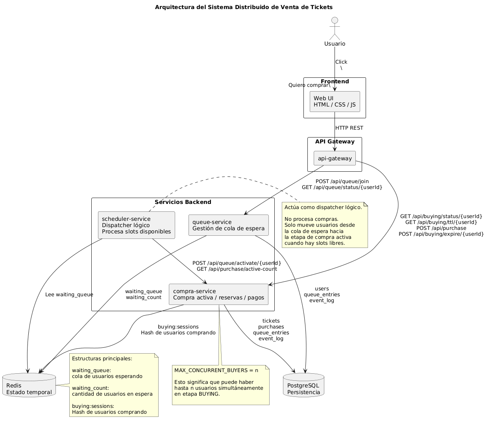

# PI-Laricchia-Nahman-Sorbello
Proyecto FInal Integrador 2026 - Aida Laricchia, Martina Nahman y Mauro Sorbello

## Descripción del proyecto

Este proyecto implementa un sistema distribuido de venta de tickets sobre un cluster Kubernetes RKE2. El objetivo es controlar el acceso concurrente de usuarios a una compra, usando una fila virtual, un scheduler que habilita turnos y una ventana de compra con tiempo límite.

La exposición externa se realiza mediante MetalLB usando el rango asignado al grupo 5: `10.66.1.51-10.66.1.60`. El frontend queda publicado en `10.66.1.52` y consume el API Gateway publicado en `10.66.1.51`.

El sistema utiliza PostgreSQL con persistencia en Cinder para guardar usuarios, tickets, compras, estados y eventos. Para el estado temporal se utiliza Valkey Cluster, compatible con Redis, donde se almacenan la cola de espera, el contador de usuarios esperando y las sesiones activas de compra.


## Componentes

- **Frontend (Web UI)**: interfaz HTML/CSS/JS desde la que el usuario inicia el flujo de compra, espera su turno, ve el TTL y confirma la entrada.

- **API Gateway**: punto de entrada único del backend. Enruta las peticiones del frontend hacia los servicios internos. Expone endpoints como `POST /api/usuarios`, `POST /api/queue/join`, `GET /api/queue/status/{userId}`, `POST /api/purchase` y `POST /api/buying/expire/{userId}`.

- **queue-service**: gestiona la cola de espera. Registra usuarios en PostgreSQL y mantiene el estado temporal de espera en Valkey Cluster mediante `waiting_queue` y `waiting_count`.

- **scheduler-service**: dispatcher lógico que corre periódicamente. Consulta cuántos usuarios están en compra activa, calcula slots disponibles y mueve usuarios desde `waiting_queue` hacia la etapa `BUYING`.

- **compra-service**: gestiona la compra activa. Recibe la activación del scheduler, reserva tickets, crea sesiones en `buying:sessions`, confirma compras y expira sesiones vencidas.

- **Valkey Cluster**: estado temporal compatible con Redis. Se usa en modo cluster para almacenar la cola, contadores y sesiones activas de compra.

- **PostgreSQL + Cinder PVC**: persistencia de usuarios, tickets, compras, estados de cola, eventos y parámetros del sistema.


## Arquitectura



El `scheduler-service` actúa como dispatcher lógico: no procesa compras ni pagos, solo mueve usuarios desde la cola de espera hacia la etapa de compra activa cuando hay slots disponibles.

El parámetro `MAX_CONCURRENT_BUYERS = n` indica que puede haber hasta `n` usuarios simultáneamente en estado `BUYING`.


## Flujo paso a paso

1. El usuario accede al frontend en `http://10.66.1.52`.

2. Al hacer click en **"Quiero comprar mi entrada"**, el frontend crea un usuario mediante el API Gateway:

   ```txt
   POST /api/usuarios
3. El api-gateway delega la creación del usuario en compra-service, que lo persiste en PostgreSQL.

4. Luego, el frontend solicita ingresar a la cola de espera:
    ```txt
    POST /api/queue/join
5. El api-gateway redirige la solicitud a queue-service.

6. El queue-service registra al usuario con estado WAITING, lo persiste en PostgreSQL y actualiza en Valkey Cluster las estructuras:
    ```txt
    waiting_queue
    waiting_count

7. El frontend consulta periódicamente el estado del usuario:
    ```txt
    GET /api/queue/status/{userId}

8. El scheduler-service se ejecuta periódicamente y actúa como dispatcher lógico. Consulta cuántos usuarios están actualmente en compra activa mediante:
    ```txt
    GET /api/purchase/active-count

9. Si hay slots libres según MAX_CONCURRENT_BUYERS, el scheduler-service toma un usuario desde waiting_queue y solicita a compra-service activarlo:
    ```txt
    POST /api/queue/activate/{userId}
10. El compra-service reserva un ticket disponible, cambia el estado del usuario a BUYING, persiste el cambio en PostgreSQL y crea una sesión activa en Valkey Cluster dentro de:
    ```txt
    buying:sessions
11. Cuando el frontend detecta que el usuario está en estado BUYING, muestra la pantalla de compra y el tiempo restante de la sesión.
12. Si el usuario confirma dentro del TTL, el frontend envía:
    ```txt
    POST /api/purchase

13. El compra-service confirma la compra, marca el ticket como vendido, registra la compra en PostgreSQL y elimina la sesión de buying:sessions.

14. Si el TTL expira, el frontend envía:
    ```txt
    POST /api/buying/expire/{userId}

15. El compra-service libera el ticket, marca la entrada como expirada y elimina la sesión activa de Valkey.

## Modelo de datos principal

| Tabla | Descripción |
|---|---|
| `queue_entries` | Registro de cada usuario en la sala de espera (`WAITING`, `BUYING`, `PURCHASED`, `EXPIRED`) |
| `tickets` | Pool de tickets disponibles y reservados |
| `purchases` | Compras confirmadas |
| `event_log` | Auditoría de eventos (`ENTER_BUYING`, `PURCHASE_CONFIRMED`, `EXPIRED`, etc.) |
| `users` | Datos de usuarios |

## Decisiones de diseño

**Cola temporal en Valkey Cluster:** la cola de espera se mantiene en Valkey mediante waiting_queue y waiting_count, permitiendo operaciones rápidas sobre el estado temporal del sistema.

**Separación entre estado temporal y persistente:** Valkey se usa para coordinación rápida de cola y sesiones activas, mientras que PostgreSQL mantiene la información persistente y auditable.

**Scheduler como dispatcher lógico:** el scheduler no procesa compras. Solo controla el avance de usuarios desde la cola hacia la etapa BUYING, respetando el límite de concurrencia.

**Límite de compradores activos:** MAX_CONCURRENT_BUYERS define cuántos usuarios pueden comprar al mismo tiempo. No representa threads físicos, sino slots lógicos de compra.

**Sesiones activas en hash:** los usuarios en compra activa se guardan en buying:sessions, usando como clave el userId y como valor los datos de la sesión, ticket reservado y vencimiento.

**TTL lógico:** como Redis/Valkey no permite TTL por campo dentro de un hash, cada sesión contiene un expiresAt. El backend valida ese vencimiento antes de confirmar una compra.

**Persistencia con Cinder:** PostgreSQL utiliza un PVC con Cinder para mantener los datos aunque el pod se reinicie o sea reprogramado.

**Servicios internos protegidos:** solo se exponen el frontend y el API Gateway. queue-service, compra-service, scheduler-service, PostgreSQL y Valkey quedan internos al cluster.
